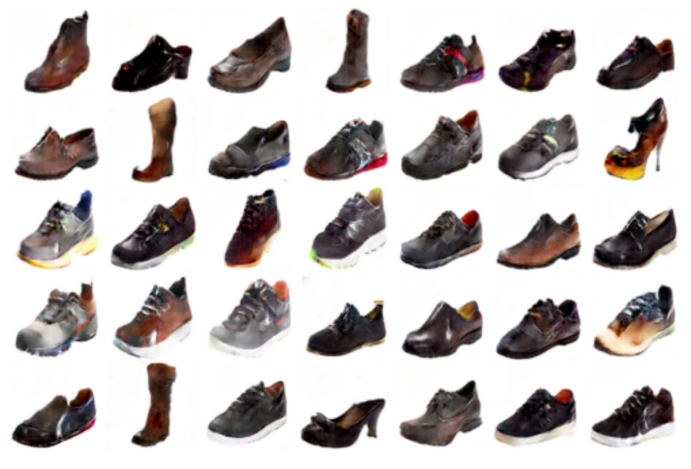
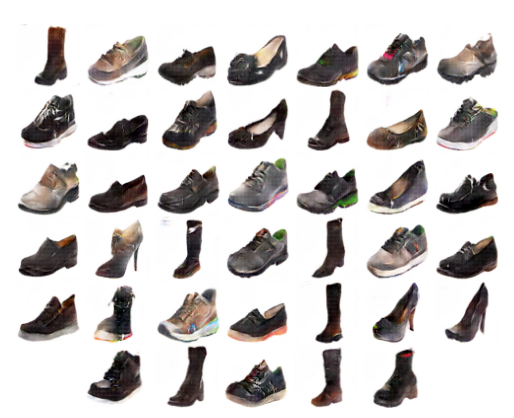

# Deep-Generative-Models
#### Dataset Used : (UTZapposs50k)[http://vision.cs.utexas.edu/projects/finegrained/utzap50k/]

##### Generative Architectures Used: 
* Convolutional AutoEncoder(CAE)
* Variational AutoEncoder(VAE)
* Generative Aderserial Networks(GAN)
* Least Squares-Generative Adverserial Networks(LSGAN)
### Few Reconstructions:
#### GAN:

#### LSGAN:

